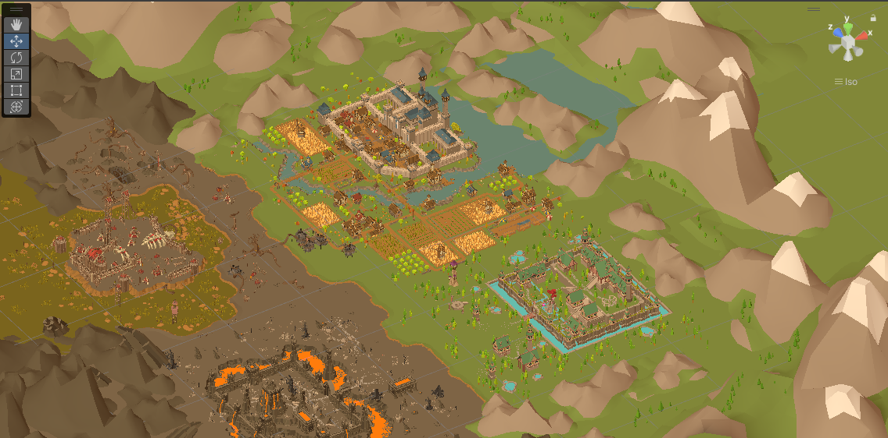

# 目录
[TOC]
# 项目简介
基于冒险者世界观的以经营养成+探险为前期主玩法，城镇战斗等其他元素为后期扩展玩法的游戏。
参考图片：

# [程序任务查看](../程序/任务管理.md)
# 系统介绍
## 地形系统
1.草地、泥土道路、石板、水等
2.特殊地形
## 建造系统
1.使用建筑块搭建房屋
2.将房屋存为预制体
3.可以有建造动画，工人慢慢建好建筑
## 角色系统
1.可以更换角色的种族、配件
2.动画系统
3.AI系统
## 冒险者召集系统
1.消耗体力召集冒险者
## 怪物系统
1.野外自动刷新
## 探险点系统
1.野外自动刷新
## 任务系统
## 商店系统
## 居民系统
 冒险者和居民是一样的，只不过一个只是临时过来你的城镇里逛逛，一个是定居了，冒险者在探索，购买东西等之后，满意度达到了，会定居，成为居民
## 宠物系统
## 世界地图系统
## 军队系统
## 夺城战
城战还没想好具体怎么做，希望是有兵去冲城门，爬城墙这种比较还原的行为的，这种也不好操作，也会做成自动的战斗，玩家最多操控士兵往哪进攻
## 转职系统
## 安排居民工作
## 平等对攻战斗系统
军队分为步兵，骑兵，弓兵，双方军队先布阵好，然后双方弓兵、骑兵、步兵轮流行动一次，没有结束，就再轮流行动一次
